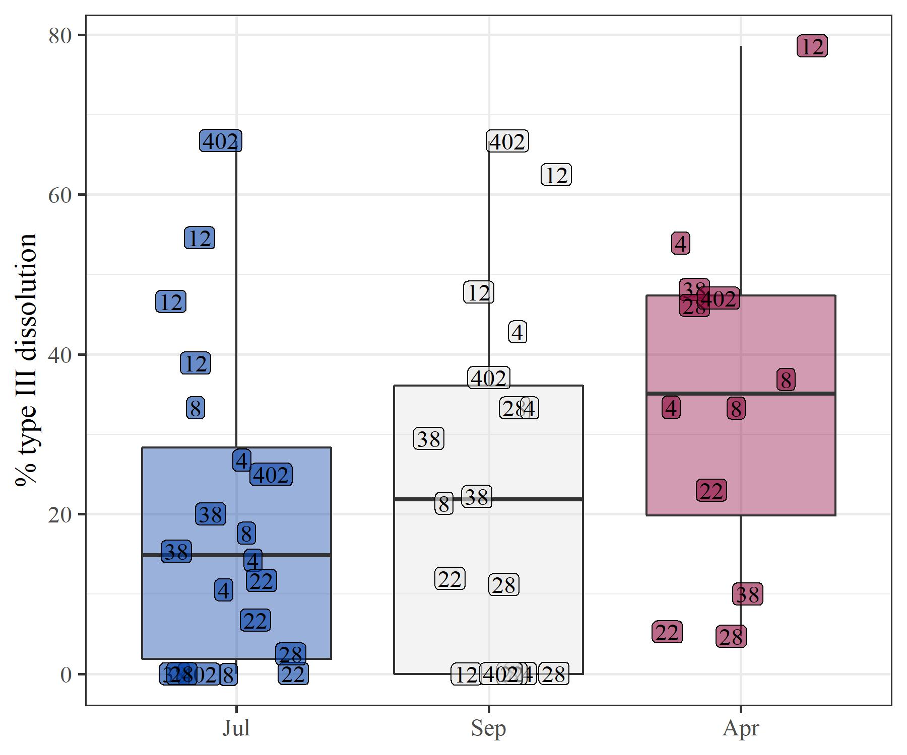
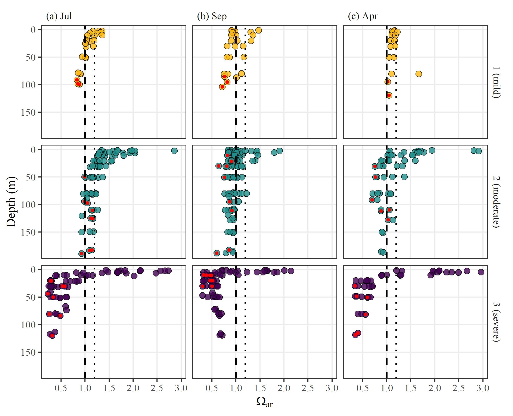
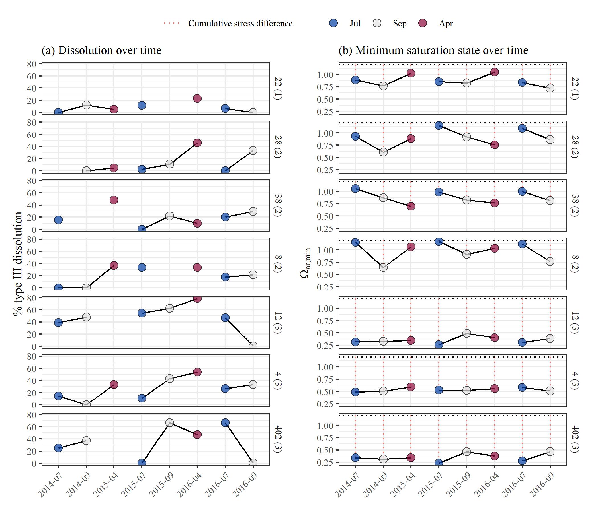
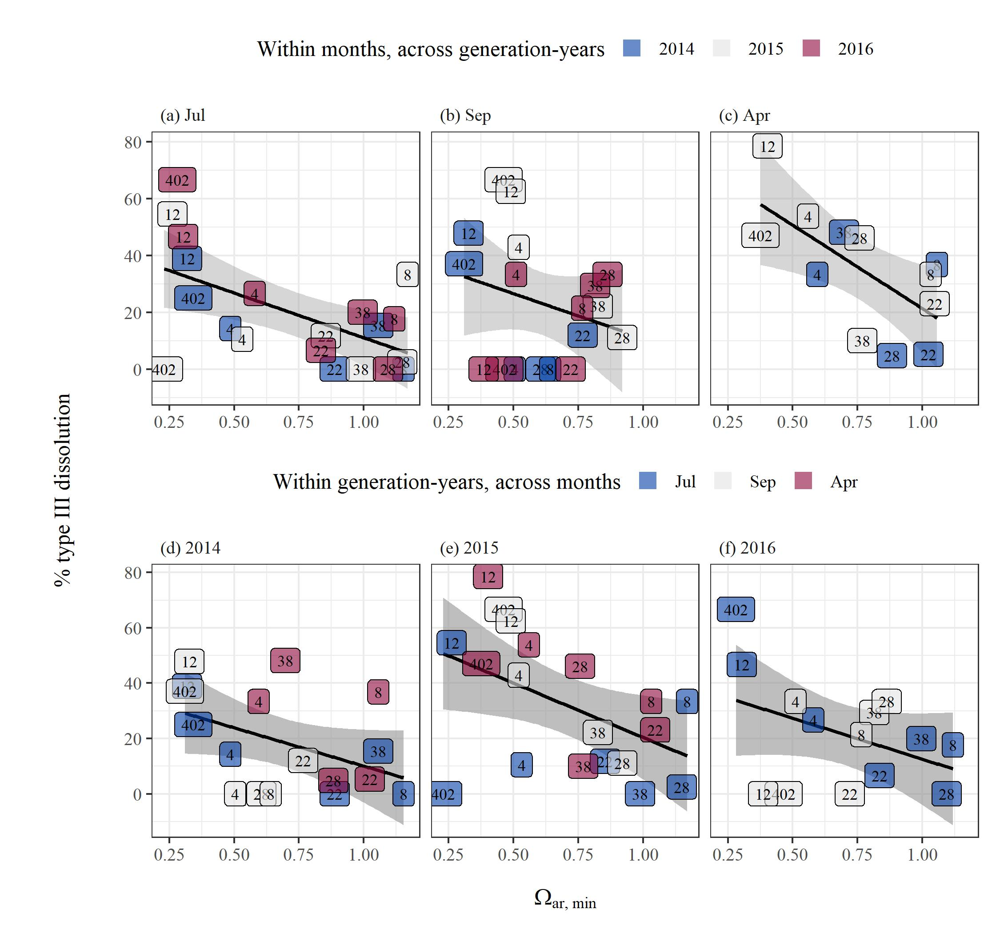

```{r message = F, warning = F, results = 'hide',echo=F}
knitr::opts_chunk$set(echo = TRUE, warning = F, message = F, fig.path = 'figs/')

library(tidyverse)
library(gridExtra)
library(glue)
library(lubridate)
library(ggord)
library(patchwork)
library(sf)
library(ggmap)
library(mapview)
library(readxl)
library(gridExtra)
library(vegan)
library(ggdendro)
library(dendextend)
library(mapview)
library(shiny)
library(mapproj)
library(viridis)
library(colorspace)
library(grid)
library(ggrepel)

prj <- 4326 # wgs84

source('R/funcs.R')

data(chmdatsum)
data(chmdatraw)
data(biodat)

pbase <- theme_bw(base_size = 12, base_family = 'serif') + 
  theme(
    axis.title = element_blank(), 
    strip.background = element_blank() 
  ) 

locs <- chmdatsum %>% 
  select(station, lon, lat) %>% 
  unique 

# get the extent
dat_ext <- make_bbox(locs$lon, locs$lat, f = 0.2)

# get the base map using the extent
bsmap <-  get_map(location = dat_ext, maptype = 'terrain-background', source = 'stamen', zoom = 8)

# viridis colors with darker yellow
colmst <- viridis(3)
colmst[3] <- '#FFB90F'

colmos <- diverging_hcl(3, 'Blue-Red')

# cluster
clsts <- tibble(
  station = c(402, 38, 28, 22, 12, 8, 4),
  clst = c(3, 2, 2, 1, 3, 2, 3)
)
```

# Figures {.tabset}

## Map

[download](figs/statmap.jpg)
```{r statmap, fig.cap = "Locations of stations in the Puget Sound where pteropod and environmental sampling occurred.  Samples were collected in April, July, and September from 2014 to 2016.", out.width = "80%", fig.align = 'center'}

```

## Site pteropod distributions

[download](figs/biodst.jpg)
```{r, results = 'hide'}
colmos <- diverging_hcl(3, 'Blue-Red')

# make cohortyr an ordered factor
toplo <- biodat %>% 
  mutate(cohortyr = factor(cohortyr, ordered = T)) %>% 
  select(mo, station, yr,typ3, len) %>% 
  gather('var', 'val', typ3, len) %>% 
  mutate(
    var = factor(var, levels = c('len', 'typ3'), labels = c('length (um)', '% type III dissolution'))
  )

p <- ggplot(toplo, aes(x = mo, y = val, fill = )) + 
  geom_boxplot(aes(fill = mo), outlier.shape = NA, alpha = 0.4) + 
  geom_label(aes(fill = mo, label = station), size = 4, alpha = 0.6, position = position_jitter(width = 0.3), 
             label.padding = unit(0.1, "lines")) +
  facet_wrap(~var, ncol = 2, scales = 'free_y', strip.position = 'left') + 
  scale_fill_manual(values = colmos) + 
  # scale_colour_manual(values = colmos) + 
  theme_bw(base_family = 'serif', base_size = 14) +
  theme(
    strip.placement = 'outside', 
    axis.title = element_blank(), 
    strip.background = element_blank(), 
    legend.position = 'none'
  )


jpeg('figs/biodst.jpg', height = 5, width = 8, units = 'in', res = 300, family = 'serif')
print(p)
dev.off()
```

```{r biodst, fig.cap = "Pteropod distributions by length (left) and dissolution (right) across sites and months.  Site numbers are shown in each point. Box plots represent the median values with the upper and lower limits of the boxes defined as the 25th and 75th percentile of the distributions.  The whiskers are 1.5 times the interquartile range.", out.width = "70%", fig.align = 'center'}

```

## Cluster analyses

[download](figs/clsts.jpg)
```{r, results = 'hide'}
depth_dat <- read_excel('raw/WOAC PS Cruise Plan.xlsx', sheet = 'Sheet2') %>% 
  select(station = Station, depth = `Depth (m)`) %>% 
  mutate(
    station = gsub('^P', '', station),
    station = as.numeric(station)
    )

toplo <- read_excel('raw/WOAC_data_5-1-2018_for_Nina.xlsx', sheet = 'ALL_DATA', na = c('', '-999')) %>% 
  select(Date_collected, STATION_NO, LATITUDE_DEC, LONGITUDE_DEC, NISKIN_NO, CTDTMP_DEG_C_ITS90, 
         CTDSAL_PSS78, CTDOXY_UMOL_KG_ADJ, `Omega Ar`) %>% 
  rename(
    date = Date_collected, 
    station = STATION_NO,
    lat = LATITUDE_DEC,
    lon = LONGITUDE_DEC,
    niskin = NISKIN_NO,
    temp = CTDTMP_DEG_C_ITS90,
    sal = CTDSAL_PSS78,
    ara = `Omega Ar`,
    oxy = CTDOXY_UMOL_KG_ADJ
  ) %>% 
  left_join(depth_dat, by = 'station') %>% 
  gather('var', 'val', temp:depth) %>% 
  group_by(station, var) %>% 
  summarize(
    valmn = mean(val, na.rm = T)
  ) %>%
  ungroup %>% 
  nest(data = everything()) %>% 
  mutate(
    
    disval = purrr::map(data, function(x){

      x %>% 
        select(station, var, valmn) %>% 
        spread(var, valmn) %>% 
        data.frame %>% 
        column_to_rownames('station') %>% 
        decostand(method = 'standardize') %>% 
        vegdist(method = 'euclidean')

    }),
    
    clsval = purrr::map(disval, function(x){
      
      x %>%  
        hclust(method = 'average')
      
    }), 
    
    cutval = purrr::map(clsval, function(x){
      
      # get cut groups
      cutree(x, k = 3)
      
    }), 
    
    denplo = purrr::pmap(list(cutval, clsval), function(cutval, clsval){
      
      # get order
      clstord <- order.hclust(clsval) %>%
        cutval[.] %>%
        unique
      
      # get colors, correct by order
      cols <- colmst %>%
        .[clstord]
      
      pdend <- clsval %>%
        as.dendrogram %>%
        set("branches_k_color", k = 3, value = cols) %>%
        set("labels_colors", k = 3, value = cols) %>%
        set("labels_cex", 0.8)
      
      p1 <- as.ggdend(pdend) %>%  
        ggplot(horiz = TRUE, offset_labels = -0.1)
      
      p1   
      
    }),
    
    displo = purrr::pmap(list(disval, cutval, clsval), function(disval, cutval, clsval){

      # prep distance data to plot
      # long format of dist matrix
      toplo <- disval %>%
        as.matrix %>%
        as.data.frame %>%
        rownames_to_column('station') %>%
        gather('station2', 'dist', -station) %>%
        arrange(dist) %>%
        mutate(
          dist = ifelse(station == station2, NA, dist)
        )
      
      # get site order levels based on clustering
      sitfc <- clsval$labels[clsval$order]
      toplo <- toplo %>%
        mutate(
          station = factor(station, levels = sitfc),
          station2 = factor(station2, levels = sitfc)
        )
      
      # plot
      p <- ggplot(toplo) +
        geom_tile(aes(x = station, y = station2, fill = dist), colour = 'black') +
        scale_x_discrete('', expand = c(0, 0)) +
        scale_y_discrete('', expand = c(0, 0)) +
        scale_fill_gradient2('Dissimilarity between stations\nby water chemistry', low = 'lightblue', mid = 'white', high = 'tomato1', midpoint = 2.5, limits = c(0.5, 4.5)) +
        guides(fill = guide_colourbar(barheight = 0.5, barwidth = 10, label.theme = element_text(size = 11, angle = 0))) +
        pbase
      
      # index values of cluster cuts
      brks <- cutval %>%
        .[clsval$order] %>%
        duplicated %>%
        `!` %>%
        which %>%
        `-` (0.5) %>%
        .[-1]
      
      p <- p +
        geom_vline(xintercept = brks, size = 1.5) +
        geom_hline(yintercept = brks, size = 1.5) +
        theme_bw(base_family = 'serif') +
        theme(
          legend.position = 'top',
          legend.direction = 'horizontal'
        )
      
      return(p)
      
    }), 
    
    disleg = purrr::map(displo, function(x) g_legend(x)),
    
    displo = purrr::map(displo, function(x){
      
      p <- x + theme(legend.position = 'none')
      
      return(p)
      
    }), 
    
    mapplo = purrr::pmap(list(clsval, cutval), function(clsval, cutval){
      
      mapplo <- locs %>%
        mutate(cutval = rev(cutval))
      
      # plot the basemap
      p <- ggmap(bsmap) +
        geom_point(data = mapplo, aes(x = lon, y = lat, fill = factor(cutval)), pch = 21, size = 8, alpha = 0.7) +
        geom_text(data = mapplo, aes(x = lon, y = lat, label = station), colour = 'white', size = 3) +
        scale_fill_manual(values = colmst) +
        theme_bw(base_family = 'serif') +
        theme(
          axis.title = element_blank(),
          legend.position = 'none',
          axis.text.y = element_text(size = 8), 
          axis.text.x = element_text(size = 8, angle = 45, hjust = 1)
        ) 
      
      return(p)
      
    })
    
  )

jpeg('figs/clsts.jpg', height = 3.7, width = 7, units = 'in', res = 300, family = 'serif')
wrap_elements(toplo$disleg[[1]]) + (toplo$denplo[[1]]+ toplo$displo[[1]] + toplo$mapplo[[1]])+ plot_layout(ncol = 1, heights = c(0.1, 1))
dev.off()
```

```{r clstmap, fig.cap = "Clustering results of stations based on annual averages of salinity, water temperature, dissolved oxygen, and aragonite saturation state.  Station-depth is also included. Averages are based on all environmental data collected across the sample years from 2014 to 2016 in the same month.  Results are shown as dendrograms for site clustering (left), dissimilarity matrices showing mean Euclidean distances between observations at pairs of sites (middle), and spatial arrangements of the defined clusters (right).  Cluster groups were set at three based on approximate dendrogram separation between sites to explain dominant patterns among environmental variables.", out.width = "70%", fig.align = 'center'}
knitr::include_graphics('figs/clsts.jpg')
```

## PCA 

[download](figs/pcastat.jpg)
```{r, results = 'hide'}
depth_dat <- read_excel('raw/WOAC PS Cruise Plan.xlsx', sheet = 'Sheet2') %>% 
  select(station = Station, depth = `Depth (m)`) %>% 
  mutate(
    station = gsub('^P', '', station),
    station = as.numeric(station)
  )

# pteropod birthday
strt <- '2008-06-01' %>% 
  as.Date

# make cohortyr an ordered factor
biodat <- biodat %>% 
  mutate(cohortyr = factor(cohortyr, ordered = T))
chmdatsum <- chmdatsum %>% 
  mutate(cohortyr = factor(cohortyr, ordered = T))

# combine data for pca
biosub <- biodat %>% 
  select(cohortyr, mo, station, typ3)

chmsub <- chmdatsum %>% 
  filter(var %in% c('ara', 'temp', 'oxy', 'sal')) %>%
  select(-date, -yr, -lon, -lat, -max, -std, -rng, -dlt) %>% 
  gather('valtyp', 'val', ave, min) %>% 
  filter(var %in% 'ara' & valtyp %in% 'min' | !var %in% 'ara' & valtyp %in% 'ave') %>% 
  select(-valtyp) %>% 
  spread(var, val)

tomod <- chmsub %>% 
  left_join(biosub, by = c('cohortyr', 'mo', 'station')) %>% 
  left_join(clsts, by = 'station') %>% 
  left_join(depth_dat, by = 'station') %>% 
  unite('stat_mo', station, mo, sep = ', ', remove = F) %>% 
  unite(stat_moyr, stat_mo, cohortyr, sep = ' ', remove = F) %>% 
  filter(!is.na(typ3)) %>% 
  as.data.frame(stringsAsFactors = F) %>% 
  column_to_rownames('stat_moyr')

# pc mod
mod <- prcomp(tomod[ , c('ara', 'oxy', 'temp', 'sal', 'depth')], scale. = T, center = T)

# no labels
p1 <- ggord(mod, grp_in = as.character(tomod$clst), vec_ext = 4, size = tomod$typ3, coord_fix = F, labcol = 'blue', alpha = 0.85) + 
  scale_size(range = c(2, 8)) +
  scale_colour_manual(values = rev(colmst)) + 
  scale_fill_manual(values = rev(colmst)) + 
  guides(size = guide_legend(title = '% type III dissolution')) + 
  theme(legend.position = 'top')
pleg <- g_legend(p1)
p1 <- p1 + theme(legend.position = 'none')

p2 <- ggord(mod, axes = c('1', '3'), grp_in = as.character(tomod$clst), vec_ext = 4, size = tomod$typ3, coord_fix = F, labcol = 'blue', alpha = 0.85) + 
  scale_size(range = c(2, 8)) +
  scale_colour_manual(values = rev(colmst)) + 
  scale_fill_manual(values = rev(colmst)) + 
  guides(size = guide_legend(title = '% type III dissolution')) + 
  theme(legend.position = 'none')

# with labels
# p2 <- ggord(mod, obslab = T, vec_ext = 4, size = 1.8, coord_fix = F, labcol = 'blue')

jpeg('figs/pcastat.jpg', family = 'serif', height = 4.5, width = 8.5, res = 300, units = 'in')
grid.arrange(
  pleg,
  arrangeGrob(p1, p2, ncol = 2),
  ncol = 1, heights = c(0.1, 1)
)
dev.off()
```

```{r pcafig, fig.cap = "Results of principal components analysis for environmental variables collected at each site for each sample date.  Environmental variables included temperature, salinity, dissolved oxygen, station depth, and minimum aragonite saturation state. All points are averages from a single CTD cast on a given date, except aragonite saturation state which was the minimum observed along the entire cast and depth which is fixed for each site. The left plot shows site groupings based on dominant clusters shown in Figure \\@ref(fig:clstmap), with site points sized by measured type III dissolution for pteropods collected at the same location and date.  The right plot shows the same as the first plot but for the first and third principal component axes.", out.width = "90%", fig.align = 'center'}
knitr::include_graphics('figs/pcastat.jpg')
```

## CTD profiles

[download](figs/ctdplo.jpg)
```{r, results = 'hide'}

# cluster
clsts <- tibble(
  station = c(402, 38, 28, 22, 12, 8, 4),
  clst = c(3, 2, 2, 1, 3, 2, 3)
)

# date levels, labels
dtlev <- as.character(sort(unique(chmdatraw$date)))
dtlab <- as.character(format(unique(chmdatraw$date), '%Y-%m'))

# chemistry raw data
toplo <- chmdatraw %>% 
  filter(var %in% 'ara') %>% 
  left_join(clsts, by = 'station') %>%   
  filter(!is.na(val)) %>% 
  group_by(date, mo, station, clst, depth, var) %>% 
  summarise(val = mean(val)) %>% 
  ungroup %>% 
  mutate(
    date = factor(date, levels = dtlev, labels = dtlab),
    alph = case_when(
      val > 1.2 ~ 0.3, 
      val > 1 & val <= 1.2 ~ 0.3,
      val <= 1 ~ 1
    )
  ) %>%
  na.omit 

p <- ggplot(toplo, aes(fill = factor(clst), x = val, y = depth)) +
  geom_point(pch = 21, colour = 'black', size = 3) +
  # geom_smooth(method="nls", 
  #             formula = y ~ SSasymp(x, yf, y0, log_alpha),
  #             se=FALSE) +
  scale_fill_manual(values = rev(colmst)) + 
  geom_vline(linetype = 'dashed', aes(xintercept = 1), size = 1) + 
  geom_vline(linetype = 'dotted', aes(xintercept = 1.2), size = 1) + 
  scale_y_reverse() + 
  scale_x_continuous(breaks = seq(0, 5, by = 0.5)) + 
  ylab('Depth (m)') +
  xlab(expression(Omega['ar,min'])) + 
  facet_grid(clst~mo) + 
  theme_bw(base_family = 'serif', base_size = 14) +
  theme(
    strip.background = element_blank(), 
    legend.title = element_blank(),
    legend.position = 'none',
    # panel.grid = element_blank(), 
    panel.grid.minor = element_blank()#,
    # axis.text.x = element_text(size = 8)
  ) 
jpeg('figs/ctdplo.jpg', height = 6.5, width = 8, units = 'in', res = 300, family = 'serif')
p
dev.off()
```

```{r ctdplo, fig.cap = "Depth profiles of minimum aragonite saturation state across seasons and stations.  Stations are grouped by clusters in Figure \\@fig(fig:clstmap) and represent sub-habitat types as described in the results section.  Vertical lines indicate minimum saturation state of 1 (dashed) and 1.2 (dotted). ", out.width = "80%", fig.align = 'center'}

```

## Observed time series

[download](figs/obsdat.jpg)
```{r, results = 'hide'}

strdat <- chmdatsum %>% 
  filter(var %in% 'ara') %>% 
  full_join(biodat, by = c('station', 'date', 'yr', 'cohortyr', 'mo')) %>% 
  select(-lon, -lat, -var, -abu, -len, -yr) %>% 
  gather('ara', 'chmval', ave:dlt) %>% 
  filter(ara %in% 'min') %>% 
  mutate(
    thrsh = 1.2,
    wts = case_when(
      mo %in% c('Jul', 'Sep') ~ 1, 
      mo == 'Apr' ~ 3.5
    ),
    aracat = ifelse(chmval < thrsh, 1, 0),
    aradff = thrsh - chmval
    ) %>% 
  unite('costa', cohortyr, station, remove = F) %>% 
  group_by(costa) %>% 
  mutate(
    strsdis = cumsum(aracat),
    strscnt = cumsum(aradff),
    strscntwt = cumsum(aradff * wts)
  ) %>%  
  ungroup %>% 
  mutate(    
    strscntwt = scales::rescale(strscntwt, to = c(0, 1))
  ) %>% 
  left_join(clsts, by = 'station') %>% 
  unite('station', station, clst, sep = ' (', remove = F) %>% 
  mutate(station = paste0(station, ')'))

# bio
toplo1 <- biodat %>% 
  select(date, yr, cohortyr, mo, station, typ1, typ2, typ3) %>% 
  gather('diss', 'val', typ1:typ3) %>% 
  filter(diss %in% 'typ3') %>% 
  left_join(clsts, by = 'station') %>% 
  unite('station', station, clst, sep = ' (', remove = F) %>% 
  mutate(station = paste0(station, ')'))

p1 <- ggplot(toplo1, aes(x = factor(date), y = val)) +
  geom_line(aes(group = cohortyr)) +
  geom_point(aes(fill = mo), alpha = 0.7, size = 3, pch = 21) +
  facet_grid(reorder(station, clst)~.) +
  theme_bw(base_family = 'serif', base_size = 10) +
  theme(
    strip.background = element_blank(), 
    axis.title.x = element_blank(), 
    legend.title = element_blank(),
    axis.text.x  = element_text(size = 8, angle = 45, hjust = 1),
    # panel.grid = element_blank(), 
    legend.position = 'none'
    ) +
  ylab('% type III dissolution') + 
  scale_x_discrete(labels = format(sort(unique(toplo1$date)), '%Y-%m')) + 
  scale_fill_manual(values = colmos)

# chem
toplo2 <- chmdatsum %>% 
  filter(var %in% 'ara') %>% 
  left_join(clsts, by = 'station') %>% 
  unite('station', station, clst, sep = ' (',remove = F) %>% 
  mutate(station = paste0(station, ')'))

p2 <- ggplot(toplo2, aes(x = factor(date), y = min)) +
  # geom_segment(data = strdat, aes(y = 1.2, yend = chmval, xend = factor(date), colour = 'Cumulative stress difference'), linetype = 'dotted', size = 0.9) +
  geom_line(aes(group = cohortyr)) +
  geom_point(aes(fill = mo), alpha = 0.7, size  = 3, pch = 21) +
  facet_grid(reorder(station, clst)~.) +
  theme_bw(base_family = 'serif', base_size = 10) + 
  theme(
    strip.background = element_blank(),
    axis.title.x = element_blank(), 
    # legend.title = element_blank(),
    axis.text.x  = element_text(size = 8, angle = 45, hjust = 1),
    # panel.grid = element_blank(), 
    legend.position = 'top'
    ) +
  guides(guide_legend) +
  scale_color_discrete(name="") +
  scale_fill_manual('Cohort months', values = colmos) +
  ylab(expression(Omega['ar,min'])) + 
  scale_x_discrete(labels = format(sort(unique(toplo2$date)), '%Y-%m'))# + 
  # geom_text(data = strdat, aes(y = 1, label = round(strscntwt, 1)), colour = 'tomato1', vjust = 1.2, size = 3, hjust = -0.2) +
  # geom_hline(aes(yintercept = 1.2), colour = 'tomato1', size = 1, alpha = 0.7)

pleg <- g_legend(p2)
p2 <- p2 + theme(legend.position = 'none')

jpeg('figs/obsdat.jpg', height = 6, width = 7, units = 'in', res = 300, family = 'serif')
wrap_elements(pleg) + 
  (p1 + p2 + plot_layout(ncol = 2)) + 
  plot_layout(ncol = 1, heights = c(0.05, 1))
dev.off()
```

```{r obsdat, fig.cap = "Observed time series for each station and subhabitat delineation (rows, group number from Figure \\@ref(fig:clstmap) in parentheses) showing % type III dissolution of pteropods (left) and observed minimum aragonite saturation state (right). Points at each station show the connectivity of different life stages. The right plot shows the selected aragonite threshold (Ωcrit =1.2) as a horizontal line with the difference between the threshold and minimum observed value shown as a dotted line.  Dissolution estimates represent averages across a subset of individuals collected at a location and date, whereas minimum aragonite saturation shows the lowest observed value sampled at a location and date. Cohort years with missing months in the left plot do not have connecting lines.", out.width = "80%", fig.align = 'center'}

```

## Dissolution vs aragonite

[download](figs/disvara.jpg)
```{r, results = 'hide'}
toplo <- chmdatsum %>% 
  filter(var %in% 'ara') %>% 
  full_join(biodat, by = c('station', 'date', 'yr', 'cohortyr', 'mo')) %>% 
  select(-lon, -lat, -var, -abu, -len) %>% 
  gather('dissvar', 'dissval', typ1:typ3) %>% 
  gather('chemvar', 'chemval', ave:dlt) %>% 
  filter(dissvar %in% 'typ3') %>% 
  filter(chemvar %in% 'min') 

p1 <- ggplot(toplo, aes(x = chemval, y = dissval)) +
  # geom_line(aes(group = station), colour = 'grey') +
  stat_smooth(method = 'lm', se = T, colour = 'black') +
  geom_point(aes(colour = factor(cohortyr), group = station), pch = 15, size = 0, alpha = 0) +
  geom_label(aes(fill = factor(cohortyr), group = station, label = station), colour = 'black', size = 3, alpha = 0.6, show.legend = F) +
  facet_grid(~ mo) + #, scales = 'free') +
  theme_bw(base_family = 'serif', base_size = 12) +
  theme(
    strip.background = element_blank(), 
    legend.title = element_blank(), 
    legend.position = 'top', 
    axis.title = element_blank()
  ) + 
  scale_fill_manual(values = colmos) + 
  scale_colour_manual(values = colmos) + 
  guides(colour = guide_legend(override.aes = list(size = 4, alpha = 0.6))) + 
  labs(
    subtitle = '(a) Within months, across years'
  )

p2 <- ggplot(toplo, aes(x = chemval, y = dissval)) +
  # geom_line(aes(group = station), colour = 'grey') +
  stat_smooth(method = 'lm', se = T, colour = 'black') +
  geom_point(aes(colour = factor(mo), group = station), pch = 15, size = 0, alpha = 0) +
  geom_label(aes(fill = factor(mo), group = station, label = station), colour = 'black', size = 3, alpha = 0.6, show.legend = F) +
  facet_grid(~ cohortyr) + #, scales = 'free') +
  theme_bw(base_family = 'serif', base_size = 12) +
  theme(
    strip.background = element_blank(), 
    legend.title = element_blank(), 
    legend.position = 'top', 
    axis.title = element_blank()
  ) + 
  scale_fill_manual(values = colmos) + 
  scale_colour_manual(values = colmos) + 
  guides(colour = guide_legend(override.aes = list(size = 4, alpha = 0.6))) + 
  labs(
    subtitle = '(b) Within years, across months'
  )

jpeg('figs/disvara.jpg', height = 7, width = 7.5, units = 'in', res = 300, family = 'serif')
wrap_elements(textGrob('           % type III dissolution', rot = 90)) + (p1 + p2 + wrap_elements(textGrob(expression(Omega['ar, min']))) + plot_layout(ncol = 1, heights = c(1, 1, 0.1))) + plot_layout(ncol = 2, widths = c(0.1, 1))
dev.off()
```

```{r disvara, fig.cap = "Percent type III dissolution measured in pteropods versus minimum observed aragonite saturation state for each station.  The top row shows stations grouped by month across cohort years and the bottom row shows stations grouped by cohort years across months.  Linear regression lines with 95\\% confidence intervals are shown in each panel.", out.width = "80%", fig.align = 'center'}

```

Linear model by years.
```{r eval = T}
modyrs <- lm(dissval ~ chemval * factor(cohortyr), data = toplo)#$toplo[!toplo$cohortyr %in% '2016', ])
summary(modyrs)
```

Linear model by months.
```{r}
modmos <- lm(dissval ~ chemval * factor(mo), data = toplo)#$toplo[!toplo$cohortyr %in% '2016', ])
summary(modmos)
```

Combined model, average aragonite.
```{r eval = T}
#data
tomod <- chmdatsum %>% 
  filter(var %in% 'ara') %>% 
  full_join(biodat, by = c('station', 'date', 'yr', 'cohortyr', 'mo')) %>% 
  select(-lon, -lat, -var, -abu, -len) %>% 
  gather('dissvar', 'dissval', typ1:typ3) %>% 
  gather('chemvar', 'chemval', ave:dlt) %>% 
  filter(dissvar %in% 'typ3') %>% 
  filter(chemvar %in% 'ave') 
# model
modall <- lm(dissval ~ chemval, data = tomod)
summary(modall)

# plot
plot(dissval ~ chemval, data = tomod)
abline(reg = modall)

# predicted
ave <- mean(tomod$chemval, na.rm = T)
toprd <- data.frame(
    chemval = c(ave + 0.4, ave), 
    lab = c('pre (1750)', 'current')
  ) %>% 
  mutate(
    type3 = predict(modall, newdata = ., se.fit = T)$fit,
    sefit = predict(modall, newdata = ., se.fit = T)$se.fit
  ) %>% 
  rename(ara = chemval)
toprd
```

Combined model, minimum aragonite.
```{r eval = T}
#data
tomod <- chmdatsum %>% 
  filter(var %in% 'ara') %>% 
  full_join(biodat, by = c('station', 'date', 'yr', 'cohortyr', 'mo')) %>% 
  select(-lon, -lat, -var, -abu, -len) %>% 
  gather('dissvar', 'dissval', typ1:typ3) %>% 
  gather('chemvar', 'chemval', ave:dlt) %>% 
  filter(dissvar %in% 'typ3') %>% 
  filter(chemvar %in% 'min') 
# model
modall <- lm(dissval ~ chemval, data = tomod)

# plot
plot(dissval ~ chemval, data = tomod)
abline(reg = modall)

# predicted
ave <- mean(tomod$chemval, na.rm = T)
toprd <- data.frame(
    chemval = c(ave + 0.5, ave), 
    lab = c('pre (1750)', 'current')
  ) %>% 
  mutate(
    type3 = predict(modall, newdata = ., se.fit = T)$fit,
    sefit = predict(modall, newdata = ., se.fit = T)$se.fit
  ) %>% 
  rename(ara = chemval)
toprd
```

## Cumulative stress plot

[download](figs/cumstr.jpg)
```{r results = 'hide'}
# rename pteropod response measure to generic
toplo <- strdat %>% 
  rename(
    rsp = 'typ3'
  ) %>% 
  filter(!cohortyr %in% 2016) %>% 
  mutate(station = gsub('\\s\\(.*\\)$', '', station))
  
p1 <- ggplot(toplo, aes(x = mo, y = strscntwt, group = costa)) +
  geom_line(linetype = 'dotted') +
  geom_point(aes(colour = mo, group = station), pch = 15, size = 0, alpha = 0) +
  geom_point(aes(group = station), pch = 15, alpha = 0, colour = 'black', position = position_jitter(width = 0.1, height = 0.1)) +
  geom_label(aes(fill = mo, group = costa, label = station), colour = 'black', position = position_jitter(width = 0.1, height = 0.1), alpha = 0.6, show.legend = F, size  = 3) +
  ylab('Cumulative stress magnitude') +
  facet_wrap(~cohortyr) +
  theme_bw(base_family = 'serif', base_size = 12) + 
  theme(
    axis.title.x = element_blank(), 
    legend.position = 'top', 
    strip.background = element_blank()
  ) + 
  guides(fill = guide_legend(title = element_blank(), override.aes = list(size = 4))) + 
  scale_colour_manual(values = colmos) + 
  scale_fill_manual(values = colmos) + 
  guides(
    colour = guide_legend(title = '', override.aes = list(size = 4, alpha = 0.6))
    ) + 
  labs(
    subtitle = '(a) Cumulative stress over time'
  )

p2 <- ggplot(toplo, aes(x = strscntwt, y = rsp)) +
  # geom_line(aes(group = costa), linetype = 'dotted') +
  geom_point(aes(colour = mo, group = station), pch = 15, size = 0, alpha = 0) +
  geom_label(aes(fill = mo, group = costa, label = station), size = 3, colour = 'black', alpha = 0.6, show.legend = F) +
  geom_smooth(method = 'lm', colour = 'black') +
  xlab('Cumulative stress magnitude') +
  ylab('% type III dissolution') +
  facet_wrap(~cohortyr) +
  theme_bw(base_family = 'serif', base_size = 12) + 
  theme(
    legend.position = 'top', 
    legend.title = element_blank(), 
    strip.background = element_blank()
  ) +
  scale_colour_manual(values = colmos) + 
  scale_fill_manual(values = colmos) + 
  guides(
    colour = guide_legend(title = '', override.aes = list(size = 4, alpha = 0.6))
    ) + 
  labs(
    subtitle = '(b) Dissolution vs cumulative stress'
  )
  
jpeg('figs/cumstr.jpg', family = 'serif', res = 300, units = 'in', height = 7.5, width = 6)
p1 + guides(colour = 'none') + p2 + plot_layout(ncol = 1, heights = c(1, 1), guides = 'collect') & theme(legend.position = 'bottom')
dev.off()
```

```{r cumstr, out.width = "70%", fig.align = 'center', fig.cap = "Relationships between percent type III dissolution and cumulative stress magnitude within cohort years.  The top plot (a) shows the progression of estimated cumulative stress from July to April throughout a cohort year for each station.  The bottom plot (b) shows the estimated linear relationship between percent dissolution and cumulative stress.  The cumulative stress estimates within a year represent the frequency and magnitude of estimated exposure time of pteropods in a cohort when conditions were under-saturated below $\\Omega_{crit} = 1.2$.  Dotted lines connect cohorts at the same station over time in (a)."}
knitr::include_graphics('figs/cumstr.jpg')
```

```{r, eval = T}
strmods <- strdat %>% 
  group_by(cohortyr) %>% 
  nest %>%
  mutate(
    mod = purrr::map(data, function(x) summary(lm(typ3 ~ strscntwt, x)))
  )
strmods
strmods$mod
```

## Supplement

[download temp](figs/profiletemp.jpg)
[download chla](figs/profilechla.jpg)
[download oxy](figs/profileoxy.jpg)
[download sal](figs/profilesal.jpg)
[download ara](figs/profileara.jpg)
```{r results = 'hide'}
# date levels, labels
dtlev <- as.character(sort(unique(chmdatraw$date)))
dtlab <- as.character(format(unique(chmdatraw$date), '%Y-%m'))

# chemistry raw data
toplo <- chmdatraw %>% 
  filter(var %in% c('temp', 'chla', 'oxy', 'sal', 'ara')) %>% 
  mutate(
    date = factor(date, levels = dtlev, labels = dtlab)
  ) %>% 
  group_by(date, mo, station, depth, var) %>% 
  summarise(val = mean(val, na.rm = T)) %>% 
  ungroup %>% 
  filter(!is.na(station)) %>% 
  group_by(var) %>% 
  nest() %>% 
  mutate(
    labs = case_when(
      var == 'oxy' ~ 'Dissolved oxygen (mg/L)', 
      var == 'temp' ~ 'Temperature (C)',
      var == 'chla' ~ 'Chlorophyll-a (ug/L)',
      var == 'sal' ~ 'Salinity (psu)', 
      var == 'ara' ~ 'Aragonite saturation'
    ),
    plos = purrr::pmap(list(labs, data), function(labs, data){
      
      p <- ggplot(data, aes(x = val, y = -depth)) +
        geom_path() + 
        geom_point(aes(fill = mo), pch = 21, colour = 'black', size = 4) + 
        ylab('Depth') +
        xlab(labs) + 
        scale_fill_viridis_d() +
        theme_bw(base_family = 'serif', base_size = 14) +
        theme(
          strip.background = element_blank(), 
          legend.title = element_blank(),
          # axis.text.x  = element_text(size = 10, angle = 45, hjust = 1),
          legend.position = 'top'
          ) + 
        facet_grid(station~date, scales = 'free_y')
      
      return(p)
      
    })
  )

jpeg('figs/profileara.jpg', family = 'serif', res = 300, units = 'in', height = 12, width = 11)
toplo %>% filter(var == 'ara') %>% pull(plos)
dev.off()

jpeg('figs/profilechla.jpg', family = 'serif', res = 300, units = 'in', height = 12, width = 11)
toplo %>% filter(var == 'chla') %>% pull(plos)
dev.off()

jpeg('figs/profileoxy.jpg', family = 'serif', res = 300, units = 'in', height = 12, width = 11)
toplo %>% filter(var == 'oxy') %>% pull(plos)
dev.off()

jpeg('figs/profiletemp.jpg', family = 'serif', res = 300, units = 'in', height = 12, width = 11)
toplo %>% filter(var == 'temp') %>% pull(plos)
dev.off()

jpeg('figs/profilesal.jpg', family = 'serif', res = 300, units = 'in', height = 12, width = 11)
toplo %>% filter(var == 'sal') %>% pull(plos)
dev.off()
```

```{r profile, out.width = "70%", fig.align = 'center', fig.cap = "Vertical profiles of aragonite saturation state, chlorophyll-a (ug/L), dissolved oxygen (mg/L), temperature (C), and salinity (psu)"}


```
