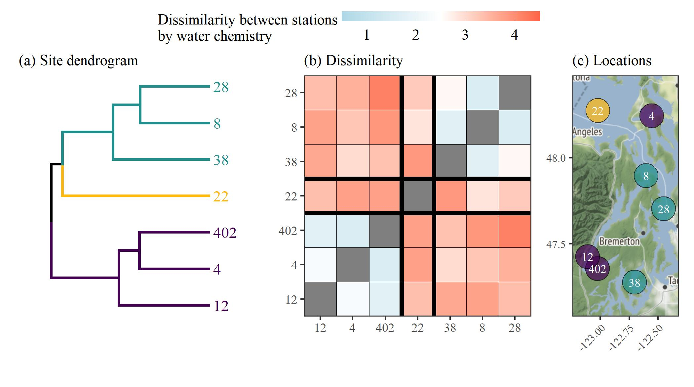
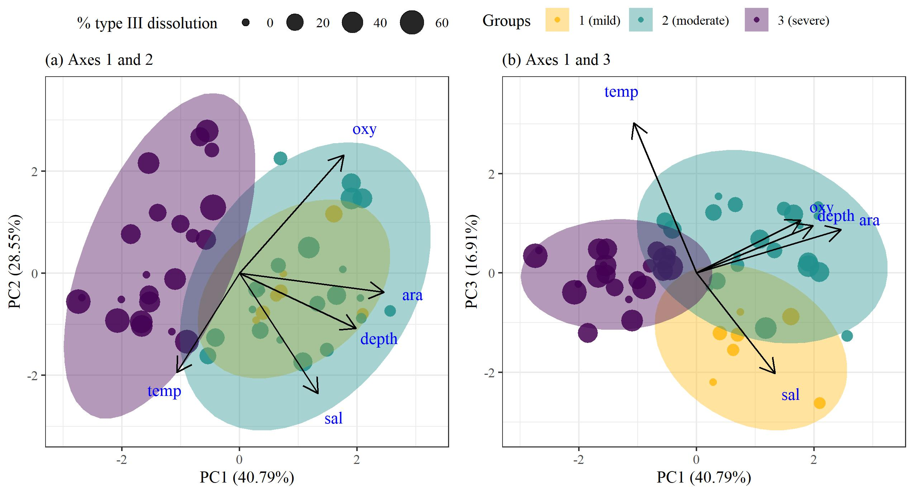
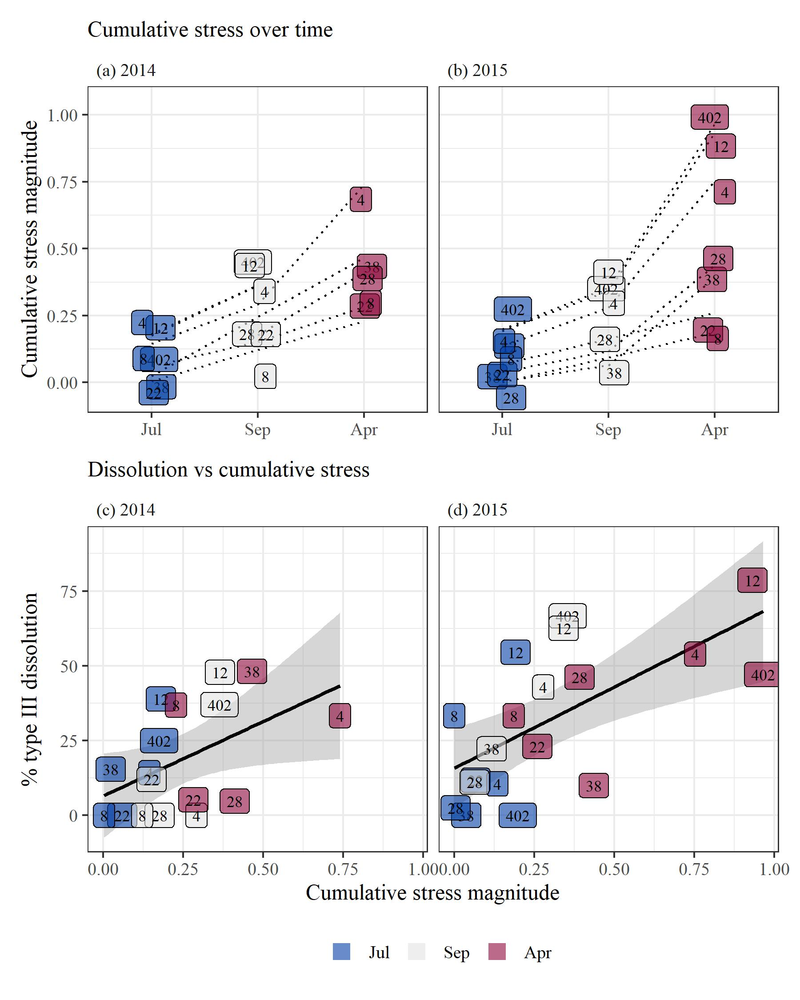

```{r message = F, warning = F, results = 'hide',echo=F}
knitr::opts_chunk$set(echo = TRUE, warning = F, message = F, fig.path = 'figs/')

library(tidyverse)
library(gridExtra)
library(glue)
library(lubridate)
library(ggord)
library(patchwork)
library(sf)
library(ggmap)
library(mapview)
library(readxl)
library(gridExtra)
library(vegan)
library(ggdendro)
library(dendextend)
library(mapview)
library(shiny)
library(mapproj)
library(viridis)
library(colorspace)
library(grid)

prj <- 4326 # wgs84

source('R/funcs.R')

data(chmdatsum)
data(chmdatraw)
data(biodat)

pbase <- theme_bw(base_size = 12, base_family = 'serif') + 
  theme(
    axis.title = element_blank(), 
    strip.background = element_blank() 
  ) 

locs <- chmdatsum %>% 
  select(station, lon, lat) %>% 
  unique 

# get the extent
dat_ext <- make_bbox(locs$lon, locs$lat, f = 0.2)

# get the base map using the extent
bsmap <-  get_map(location = dat_ext, maptype = 'terrain-background', source = 'stamen', zoom = 8)

# viridis colors with darker yellow
colmst <- viridis(3)
colmst[3] <- '#FFB90F'

colmos <- diverging_hcl(3, 'Blue-Red')
```

# Figures {.tabset}

## Map

[download](figs/statmap.jpg)
```{r statmap, fig.cap = "Locations of stations in the Puget Sound where pteropod and environmental sampling occurred.  Samples were collected in April, July, and September from 2014 to 2016.", out.width = "80%", fig.align = 'center'}
knitr::include_graphics('figs/statmap.jpg')
```

## Cluster analyses

[download](figs/clsts.jpg)
```{r, results = 'hide'}
toplo <- read_excel('raw/WOAC_data_5-1-2018_for_Nina.xlsx', sheet = 'ALL_DATA', na = c('', '-999')) %>% 
  select(Date_collected, STATION_NO, LATITUDE_DEC, LONGITUDE_DEC, NISKIN_NO, CTDTMP_DEG_C_ITS90, 
         CTDSAL_PSS78, CTDOXY_UMOL_KG_ADJ, `Omega Ar`) %>% 
  rename(
    date = Date_collected, 
    station = STATION_NO,
    lat = LATITUDE_DEC,
    lon = LONGITUDE_DEC,
    niskin = NISKIN_NO,
    temp = CTDTMP_DEG_C_ITS90,
    sal = CTDSAL_PSS78,
    ara = `Omega Ar`,
    oxy = CTDOXY_UMOL_KG_ADJ
  ) %>% 
  mutate(
    date = as.Date(date)
  ) %>% 
  gather('var', 'val', temp:ara) %>% 
  group_by(station) %>% 
  mutate(
    lat = mean(lat), 
    lon = mean(lon),
    yr = year(date), 
    mo = month(date)
  ) %>% 
  filter(mo %in% c(4, 7, 9, 10)) %>%
  mutate(
    mo = case_when(
      yr == 2014 & mo == 10 ~ 9,
      TRUE ~ mo
    ),
    mo = month(mo, label = T)
  ) %>% 
  group_by(station, var, mo, lat, lon) %>% 
  summarise(
    valmn = mean(val, na.rm = T),
    valsd = sd(val, na.rm = T)
  ) %>% 
  ungroup %>% 
  mutate(
    mo = factor(mo, levels = c('Jul', 'Sep', 'Apr'))
  ) %>% 
  group_by(mo) %>% 
  nest %>% 
  arrange(mo) %>% 
  mutate(
    
    disval = purrr::map(data, function(x){
      
      x %>% 
        select(station, var, valmn) %>% 
        spread(var, valmn) %>% 
        data.frame %>% 
        column_to_rownames('station') %>% 
        decostand(method = 'standardize') %>% 
        vegdist(method = 'euclidean')

    }),
    
    clsval = purrr::map(disval, function(x){
      
      x %>%  
        hclust(method = 'average')
      
    }), 
    
    cutval = purrr::map(clsval, function(x){
  
      # get cut groups
      cutree(x, k = 3)
      
    }), 
    
    denplo = purrr::pmap(list(as.character(mo), cutval, clsval), function(mo, cutval, clsval){

      # get order
      clstord <- order.hclust(clsval) %>%
        cutval[.] %>%
        unique
    
      # get colors, correct by order
      cols <- colmst %>%
        .[clstord]
    
      pdend <- clsval %>%
        as.dendrogram %>%
        set("branches_k_color", k = 3, value = cols) %>%
        set("labels_colors", k = 3, value = cols) %>%
        set("labels_cex", 0.8)
        
      p1 <- as.ggdend(pdend) %>%  
        ggplot(horiz = TRUE, offset_labels = -0.1) + 
        ggtitle(mo)
      
      p1   
      
    }),
    
    displo = purrr::pmap(list(disval, cutval, clsval), function(disval, cutval, clsval){
      
      # prep distance data to plot
      # long format of dist matrix
      toplo <- disval %>%
        as.matrix %>%
        as.data.frame %>%
        rownames_to_column('station') %>%
        gather('station2', 'dist', -station) %>%
        arrange(dist) %>%
        mutate(
          dist = ifelse(station == station2, NA, dist)
          )
    
      # get site order levels based on clustering
      sitfc <- clsval$labels[clsval$order]
      toplo <- toplo %>%
        mutate(
          station = factor(station, levels = sitfc),
          station2 = factor(station2, levels = sitfc)
        )
    
      # plot
      p <- ggplot(toplo) +
        geom_tile(aes(x = station, y = station2, fill = dist), colour = 'black') +
        scale_x_discrete('', expand = c(0, 0)) +
        scale_y_discrete('', expand = c(0, 0)) +
        scale_fill_gradient2('Dissimilarity between stations\nby water chemistry', low = 'lightblue', mid = 'white', high = 'tomato1', midpoint = 2.5, limits = c(0.5, 4.5)) +
        guides(fill = guide_colourbar(barheight = 0.5, barwidth = 10, label.theme = element_text(size = 11, angle = 0))) +
        pbase
    
      # index values of cluster cuts
      brks <- cutval %>%
        .[clsval$order] %>%
        duplicated %>%
        `!` %>%
        which %>%
        `-` (0.5) %>%
        .[-1]
    
      p <- p +
        geom_vline(xintercept = brks, size = 1.5) +
        geom_hline(yintercept = brks, size = 1.5) +
        theme_bw(base_family = 'serif') +
        theme(
          legend.position = 'top',
          legend.direction = 'horizontal'
        )
    
      return(p)

    }), 
    
    disleg = purrr::map(displo, function(x) g_legend(x)),
    
    displo = purrr::pmap(list(as.character(mo), displo), function(mo, displo){
      
      # p <- displo
      # if(mo != 'Apr')
        p <- displo + theme(legend.position = 'none')
    
      return(p)
    
    }), 
    
    mapplo = purrr::pmap(list(clsval, cutval), function(clsval, cutval){

      mapplo <- locs %>%
        mutate(cutval = rev(cutval))

      # plot the basemap
      p <- ggmap(bsmap) +
        geom_point(data = mapplo, aes(x = lon, y = lat, fill = factor(cutval)), pch = 21, size = 8, alpha = 0.7) +
        geom_text(data = mapplo, aes(x = lon, y = lat, label = station), colour = 'white', size = 3) +
        scale_fill_manual(values = colmst) +
        theme_bw(base_family = 'serif') +
        theme(
          axis.title = element_blank(),
          legend.position = 'none',
          axis.text.y = element_text(size = 8), 
          axis.text.x = element_text(size = 8, angle = 45, hjust = 1)
          ) 
      
      return(p)
          
    })
    
  )

jpeg('figs/clsts.jpg', height = 9.5, width = 7, units = 'in', res = 300, family = 'serif')
wrap_elements(toplo$disleg[[1]]) + (toplo$denplo[[1]]+ toplo$displo[[1]] + toplo$mapplo[[1]] + toplo$denplo[[2]] + toplo$displo[[2]] + toplo$mapplo[[2]] + toplo$denplo[[3]] + toplo$displo[[3]] + toplo$mapplo[[3]] + plot_layout(ncol = 3, widths = c(1, 1, .5))) + plot_layout(ncol = 1, heights = c(0.05, 1))
dev.off()

```

```{r clstmap, fig.cap = "Clustering results of stations based on within-month averages for salinity, water temperature, dissolved oxygen, and aragonite saturation state.  Within-month averages are based on all environmental data collected across the sample years from 2014 to 2016 in the same month.  Results for each month (starting in July the prior year coinciding with spring spawning) are shown as dendrograms for site clustering (left), dissimilarity matrices showing mean Euclidean distances between observations at pairs of sites (middle), and spatial arrangements of the defined clusters (right).  Cluster groups were set at three based on approximate dendrogram separation between sites to explain dominant patterns among environmental variables.", out.width = "70%", fig.align = 'center'}

```

```{r, results = 'hide'}

# cluster
clsts <- tibble(
  station = c(402, 38, 28, 22, 12, 8, 4),
  clst = c(3, 2, 2, 1, 3, 2, 3)
)

# pteropod birthday
strt <- '2008-06-01' %>% 
  as.Date

# make cohortyr an ordered factor
biodat <- biodat %>% 
  mutate(cohortyr = factor(cohortyr, ordered = T))
chmdatsum <- chmdatsum %>% 
  mutate(cohortyr = factor(cohortyr, ordered = T))

# combine data for pca
biosub <- biodat %>% 
  select(cohortyr, mo, station, typ3)

chmsub <- chmdatsum %>% 
  filter(var %in% c('ara', 'sal', 'temp', 'oxy')) %>%
  select(-date, -yr, -lon, -lat, -max, -min, -std, -rng, -dlt) %>% 
  spread(var, ave)

tomod <- chmsub %>% 
  left_join(biosub, by = c('cohortyr', 'mo', 'station')) %>% 
  left_join(clsts, by = 'station') %>% 
  unite('stat_mo', station, mo, sep = ', ', remove = F) %>% 
  unite(stat_moyr, stat_mo, cohortyr, sep = ' ', remove = F) %>% 
  filter(!is.na(typ3)) %>% 
  as.data.frame(stringsAsFactors = F) %>% 
  column_to_rownames('stat_moyr')

# pc mod
mod <- prcomp(tomod[ , c('ara', 'oxy', 'sal', 'temp')], scale. = T, center = T)

# no labels
p1 <- ggord(mod, grp_in = as.character(tomod$clst), vec_ext = 4, size = tomod$typ3, coord_fix = F, labcol = 'darkblue') + 
  scale_size(range = c(2, 8)) +
  scale_colour_manual(values = colmst) + 
  scale_fill_manual(values = colmst) + 
  guides(size = guide_legend(title = '% type III dissolution')) + 
  theme(legend.position = 'top')
pleg <- g_legend(p1)
p1 <- p1 + theme(legend.position = 'none')
 
# with labels
p2 <- ggord(mod, obslab = T, vec_ext = 4, size = 1.8, coord_fix = F, labcol = 'darkblue') 

jpeg('figs/pcastat.jpg', family = 'serif', height = 4.5, width = 8.5, res = 300, units = 'in')
grid.arrange(
  pleg,
  arrangeGrob(p1, p2, ncol = 2),
  ncol = 1, heights = c(0.1, 1)
)
dev.off()

```

## PCA 

[download](figs/pcastat.jpg)
```{r pcafig, fig.cap = "Results of prinicipal components analysis for environmental variables collected at each site for each sample date.  Environmental variables included temperature, salinity, dissolved oxygen, and aragonite saturation state. The left plot shows site groupings based on dominant clusters shown in Figure \\@ref(fig:clstmap), with site points sized by measured type III dissolution for pteropods collected at the same location and date.  The right plot shows the sites with text identifiers for the site number, followed by the month and sample year.", out.width = "90%", fig.align = 'center'}

```

## Observed time series

[download](figs/obsdat.jpg)
```{r, results = 'hide'}
strdat <- chmdatsum %>% 
  filter(var %in% 'ara') %>% 
  full_join(biodat, by = c('station', 'date', 'yr', 'cohortyr', 'mo')) %>% 
  select(-lon, -lat, -var, -abu, -avesz, -stdsz, -yr) %>% 
  gather('ara', 'chmval', ave:dlt) %>% 
  filter(ara %in% 'min') %>% 
  mutate(
    thrsh = 1,
    aracat = ifelse(chmval < thrsh, 1, 0),
    aradff = thrsh - chmval
    ) %>% 
  unite('costa', cohortyr, station, remove = F) %>% 
  group_by(costa) %>% 
  mutate(
    strsdis = cumsum(aracat),
    strscnt = cumsum(aradff)
  ) 

# bio
toplo1 <- biodat %>% 
  select(date, yr, cohortyr, mo, station, typ1, typ2, typ3) %>% 
  gather('diss', 'val', typ1:typ3) %>% 
  filter(diss %in% 'typ3')

p1 <- ggplot(toplo1, aes(x = factor(date), y = val)) +
  geom_line(aes(group = cohortyr)) +
  geom_point(aes(fill = mo), alpha = 0.7, size = 3, pch = 21) +
  facet_grid(station~.) +
  theme_bw(base_family = 'serif', base_size = 10) +
  theme(
    strip.background = element_blank(), 
    axis.title.x = element_blank(), 
    legend.title = element_blank(),
    axis.text.x  = element_text(size = 8, angle = 45, hjust = 1),
    # panel.grid = element_blank(), 
    legend.position = 'none'
    ) +
  ylab('% type III dissolution') + 
  scale_x_discrete(labels = format(sort(unique(toplo1$date)), '%Y-%m')) + 
  scale_fill_manual(values = colmos)

# chem
toplo2 <- chmdatsum %>% 
  filter(var %in% 'ara')

p2 <- ggplot(toplo2, aes(x = factor(date), y = min)) +
  geom_segment(data = strdat, aes(y = 1, yend = chmval, xend = factor(date), colour = 'Cumulative stress difference'), linetype = 'dotted', size = 0.9) +
  geom_line(aes(group = cohortyr)) +
  geom_point(aes(fill = mo), alpha = 0.7, size  = 3, pch = 21) +
  facet_grid(station~.) +
  theme_bw(base_family = 'serif', base_size = 10) + 
  theme(
    strip.background = element_blank(), 
    axis.title.x = element_blank(), 
    # legend.title = element_blank(),
    axis.text.x  = element_text(size = 8, angle = 45, hjust = 1),
    # panel.grid = element_blank(), 
    legend.position = 'top'
    ) +
  guides(guide_legend) +
  scale_color_discrete(name="") +
  scale_fill_manual('Cohort months', values = colmos) +
  ylab(expression("Minimum observed  "*Omega)) + 
  scale_x_discrete(labels = format(sort(unique(toplo2$date)), '%Y-%m')) + 
  geom_hline(yintercept = 1, colour = 'tomato1', size = 1, alpha = 0.7) +
  geom_text(data = strdat, aes(y = 1, label = round(strscnt, 1)), colour = 'tomato1', vjust = 1.2, size = 3, hjust = -0.2)

pleg <- g_legend(p2)
p2 <- p2 + theme(legend.position = 'none')

jpeg('figs/obsdat.jpg', height = 6, width = 7, units = 'in', res = 300, family = 'serif')
wrap_elements(pleg) + 
  (p1 + p2 + plot_layout(ncol = 2)) + 
  plot_layout(ncol = 1, heights = c(0.05, 1))
dev.off()
```

```{r obsdat, fig.cap = "Observed time series for each station (rows) showing \\% type III dissolution of pteropods (left) and observed minimum aragonite saturation state (right).  Points at each station are connected by cohort years.  The right plot shows the selected aragonite threshold ($\\Omega_{crit} = 1$) as a horizontal line with the difference between the threshold and minimum observed value shown as a dotted line.", out.width = "80%", fig.align = 'center'}
knitr::include_graphics('figs/obsdat.jpg')
```

## Dissolution vs aragonite

[download](figs/disvara.jpg)
```{r, results = 'hide'}
toplo <- chmdatsum %>% 
  filter(var %in% 'ara') %>% 
  full_join(biodat, by = c('station', 'date', 'yr', 'cohortyr', 'mo')) %>% 
  select(-lon, -lat, -var, -abu, -avesz, -stdsz) %>% 
  gather('dissvar', 'dissval', typ1:typ3) %>% 
  gather('chemvar', 'chemval', ave:dlt) %>% 
  filter(dissvar %in% 'typ3') %>% 
  filter(chemvar %in% 'min') 

p1 <- ggplot(toplo, aes(x = chemval, y = dissval)) +
  # geom_line(aes(group = station), colour = 'grey') +
  stat_smooth(method = 'lm', se = T, colour = 'black') +
  geom_point(aes(colour = factor(cohortyr), group = station), pch = 15, size = 0, alpha = 0) +
  geom_label(aes(fill = factor(cohortyr), group = station, label = station), colour = 'black', size = 3, alpha = 0.6, show.legend = F) +
  facet_grid(~ mo) + #, scales = 'free') +
  theme_bw(base_family = 'serif', base_size = 12) +
  theme(
    strip.background = element_blank(), 
    legend.title = element_blank(), 
    legend.position = 'top', 
    axis.title = element_blank()
  ) + 
  scale_fill_manual(values = colmos) + 
  scale_colour_manual(values = colmos) + 
  guides(colour = guide_legend(override.aes = list(size = 4, alpha = 0.6)))

p2 <- ggplot(toplo, aes(x = chemval, y = dissval)) +
  # geom_line(aes(group = station), colour = 'grey') +
  stat_smooth(method = 'lm', se = T, colour = 'black') +
  geom_point(aes(colour = factor(mo), group = station), pch = 15, size = 0, alpha = 0) +
  geom_label(aes(fill = factor(mo), group = station, label = station), colour = 'black', size = 3, alpha = 0.6, show.legend = F) +
  facet_grid(~ cohortyr) + #, scales = 'free') +
  theme_bw(base_family = 'serif', base_size = 12) +
  theme(
    strip.background = element_blank(), 
    legend.title = element_blank(), 
    legend.position = 'top', 
    axis.title = element_blank()
  ) + 
  scale_fill_manual(values = colmos) + 
  scale_colour_manual(values = colmos) + 
  guides(colour = guide_legend(override.aes = list(size = 4, alpha = 0.6)))

jpeg('figs/disvara.jpg', height = 6, width = 7, units = 'in', res = 300, family = 'serif')
wrap_elements(textGrob('           % type III dissolution', rot = 90)) + (p1 + p2 + wrap_elements(textGrob(expression("Minimum observed "*Omega))) + plot_layout(ncol = 1, heights = c(1, 1, 0.1))) + plot_layout(ncol = 2, widths = c(0.1, 1))
dev.off()
```

```{r disvara, fig.cap = "Percent type III dissolution measured in pteropods versus minimum observed aragonite saturation state for each station.  The top row shows stations grouped by month across cohort years and the bottom row shows stations gruoped by cohort years across months.  Linear regression lines with 95\\% confidence intervals are shown in each panel.", out.width = "80%", fig.align = 'center'}
knitr::include_graphics('figs/disvara.jpg')
```

## oxygen and aragonite 

[download](figs/oxyint.jpg)
```{r results = 'hide'}
# input
oxydat <- chmdatsum %>% 
  filter(var %in% c('ara', 'oxy', 'araund')) %>% 
  full_join(biodat, by = c('station', 'date', 'yr', 'cohortyr', 'mo')) %>% 
  select(-lon, -lat, -abu, -avesz, -stdsz) %>% 
  gather('dissvar', 'dissval', typ1:typ3) %>% 
  gather('chemvar', 'chemval', ave:dlt) %>% 
  filter(dissvar %in% 'typ3')

plo1dat <- oxydat %>% 
  filter(var %in% 'araund' & chemvar %in% 'min' | var %in% 'oxy' & chemvar %in% 'ave') %>% 
  select(-chemvar) %>% 
  spread(var, chemval) %>% 
  filter(mo %in% c('Jul')) %>% 
  mutate(araund = 100 * araund)

plo2dat <- oxydat %>% 
  filter(var %in% 'ara' & chemvar %in% 'rng' | var %in% 'oxy' & chemvar %in% 'ave') %>% 
  select(-chemvar) %>% 
  spread(var, chemval) %>% 
  filter(mo %in% c('Jul'))

plo1mod <- lm(dissval ~ araund * oxy, data = plo1dat)
plo2mod <- lm(dissval ~ ara + oxy, data = plo2dat)

# colors
cols <- RColorBrewer::brewer.pal(9, 'RdBu')
  
# get data to plot
pldat <- get_pldat(plo1mod, 'oxy', fct = 1.02, pos = 'right') 
pl1a <- pldat[[1]]
pl1b <- pldat[[2]]
  
# names for aes_string
nms <- names(pl1a)
p1 <- ggplot() +
  geom_ribbon(data = pl1a, aes_string(x = nms[3], ymin = 'lo', ymax = 'hi', group = nms[4]), alpha = 0.5, fill = 'grey') +
  geom_line(data = pl1a, aes_string(x = nms[3], y = nms[1], group = nms[4], colour = nms[4]), size = 1) + 
  geom_text(data = pl1b, aes(x= x, y = y, label = lab), hjust = 0) +
  theme_bw() +
  scale_x_continuous('% water column undersaturated', limits = c(0, 95)) +
  scale_colour_gradientn(expression(paste('Average ',O[2])), colours = cols) + 
  theme(
    axis.title.y = element_blank(),
    legend.position = 'none'
  )

# get data to plot
pldat <- get_pldat(plo2mod, 'oxy', pos = 'right', fct = 1.02) 
pl2a <- pldat[[1]]
pl2b <- pldat[[2]]
  
# names for aes_string
nms <- names(pl2a)
p2 <- ggplot() +
  geom_ribbon(data = pl2a, aes_string(x = nms[3], ymin = 'lo', ymax = 'hi', group = nms[4]), alpha = 0.5, fill = 'grey') +
  geom_line(data = pl2a, aes_string(x = nms[3], y = nms[1], group = nms[4], colour = nms[4]), size = 1) + 
  geom_text(data = pl2b, aes(x= x, y = y, label = lab), hjust = 0) +
  theme_bw() +
  scale_x_continuous(expression('Observed range for '*Omega), limits = c(0.3, 2.65)) +
  scale_colour_gradientn(expression(paste('Average ',O[2])), colours = cols) + 
  theme(axis.title.y = element_blank())
pleg <- g_legend(p2)
p2 <- p2 + theme(legend.position = 'none') 

jpeg('figs/oxyint.jpg', family = 'serif', height = 6, width = 5, res = 300, units = 'in')
wrap_elements(textGrob('% type III dissolution        ', rot = 90)) + (p1 + p2 + plot_layout(ncol = 1)) + pleg + plot_layout(ncol = 3, widths = c(0.1, 1, 0.4))
dev.off()
```

```{r oxyint, fig.cap = 'Interactions and additive effects of dissolved oxygen and aragonite saturation state on dissolution measures of pteropods. The top plot shows a linear model with a significant interaction between oxygen and the percentage of the water column undersaturated for aragonite, where the latter predictor had a significant main effect on dissolution.  The bottom plot shows a linear model with significant main effects for both oxygen and the observed range of aragonite saturation state in the water column for each site.  The color range depicts the minimum and maximum observed values for average dissolved oxygen across all stations.', fig.align = 'center', out.width = "55%"}
knitr::include_graphics('figs/oxyint.jpg')
```

## Cumulative stress plot

[download](figs/cumstr.jpg)
```{r results = 'hide'}
# rename pteropod response measure to generic
toplo <- strdat %>% 
  rename(
    rsp = 'typ3'
  )
  
p1 <- ggplot(toplo, aes(x = mo, y = strscnt, group = costa)) +
  geom_line(linetype = 'dotted') +
  geom_point(aes(colour = mo, group = station), pch = 15, size = 0, alpha = 0) +
  geom_point(aes(group = station, size = rsp), pch = 15, alpha = 0, colour = 'black', position = position_jitter(width = 0.1, height = 0.1)) +
  geom_label(aes(fill = mo, group = costa, label = station, size = rsp), colour = 'black', position = position_jitter(width = 0.1, height = 0.1), alpha = 0.6, show.legend = F) +
  ylab('Cumulative stress magnitude') +
  facet_wrap(~cohortyr) +
  theme_bw(base_family = 'serif', base_size = 12) + 
  theme(
    axis.title.x = element_blank(), 
    legend.position = 'top', 
    strip.background = element_blank()
  ) + 
  scale_size('% type III dissolution') +
  guides(fill = guide_legend(title = element_blank(), override.aes = list(size = 4))) + 
  scale_colour_manual(values = colmos) + 
  scale_fill_manual(values = colmos) + 
  guides(
    colour = guide_legend(title = '', override.aes = list(size = 4, alpha = 0.6)),
    size = guide_legend(override.aes = list(size = seq(2, 8, length = 4), alpha = 0.6))
    )

p2 <- ggplot(toplo, aes(x = strscnt, y = rsp)) +
  geom_line(aes(group = costa), linetype = 'dotted') +
  geom_point(aes(colour = mo, group = station), pch = 15, size = 0, alpha = 0) +
  geom_label(aes(fill = mo, group = costa, label = station), size = 3, colour = 'black', alpha = 0.6, show.legend = F) +
  geom_smooth(method = 'lm', colour = 'black') +
  xlab('Cumulative stress magnitude') +
  ylab('% type III dissolution') +
  facet_wrap(~cohortyr) +
  theme_bw(base_family = 'serif', base_size = 12) + 
  theme(
    legend.position = 'top', 
    legend.title = element_blank(), 
    strip.background = element_blank()
  ) +
  scale_colour_manual(values = colmos) + 
  scale_fill_manual(values = colmos) + 
  guides(
    colour = guide_legend(title = '', override.aes = list(size = 4, alpha = 0.6))
    )
  
jpeg('figs/cumstr.jpg', family = 'serif', res = 300, units = 'in', height = 7, width = 7)
p1 + p2 + plot_layout(ncol = 1, heights = c(1, 1))
dev.off()
```

```{r cumstr, out.width = "70%", fig.align = 'center', fig.cap = "Relationships between percent type III dissolution and cumulative stress magnitude within cohort years.  The top plot shows the progression of estimated cumulative stress from July to April throughout a cohort year for each station, with points sized by percent dissolution.  The bottom plot shows the estimated linear relationship between percent dissolution and cumulative stress.  The cumulative stress estimates within a year represent the frequency and magnitude of estimated exposure time of pteropods in a cohort when conditions were under-saturatated below $\\Omega_{crit} = 1$."}

```


